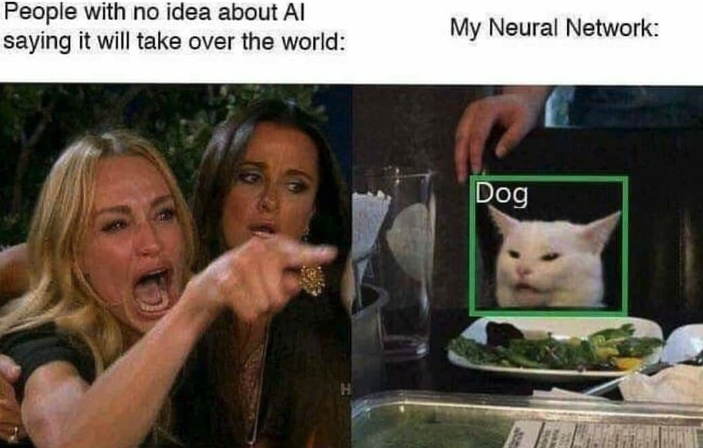
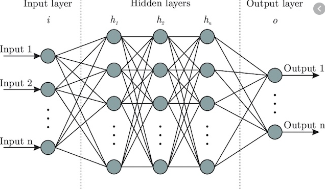

```{r setup, include=FALSE}
knitr::opts_chunk$set(echo = TRUE)
setwd("~/.")
```

# Neural Network Introduction

"A neural network is the second best way to solve any problem. The best way is to actually understand the problem." -*Unknown*

{width=80%}

### What are they?
A neural network is a parallel, distributed information processing structure consisting of processing elements (nodes) interconnected together with unidirectional signal channels. Each node has a single output connection which branches into as many collateral connections as desired. The node's output signal can be of any mathematical value (can later be converted to non-numerical values). All of the processing that goes on within each node must depend only upon the values of the received input signals arriving at the node via incoming connections and upon values stored in the node's local memory (Hecht-Nielsen 1992).

### Theory behind them
Neural networks are a subset of machine learning that are an amalgamation of modern computer science and cognitive psychology. The data processing and analysis is based on the same process that your brains' neurons undergo to process information. Your neurons require a certain amount of activation energy in order to fire and send information beyond the neuron and along to the axon, synapses, to other neurons and so on, an input requirement known as action potential.   

### History of neural networks
- 1943: A couple of old-timey neurophysiologists named McCulloch & Pitts developed the first neural network with electrical circuitry to try to recreate the connections and processing of information within the brain
- 1949: Donald Webb proposed that neural pathways become stronger with more frequent use
- 1958: Frank Rosenblatt publishes a paper with the **Perceptron** concept as an answer for fly's fight or flight response to stimuli (this was a huge breakthrough)

{width=40%}

- 1959: First application of neural networks from Stanford lab used to filter out noise in phone lines (still used to this day)
- 1969: Start of the AI "dark ages" where the Perceptron idea was killed by MIT (wrongly) followed by the cold war which made people overly-terrified of technology
- 1986: People got over this intellectual blockade and resumed research in AI and more specifically neural networks. This was catalyzed by the re-discovery of an older theory called **Backpropogation** which made neural networks much more applicable for larger, more diverse datasets.
- 2006: The development of the deep neural network (DNN), most common models created to date.

### What led to the development and use of them?
Originally, scientists were simply interested if they could recreate how the human brain works; they really didn't have any desire to make this concept much more than a concept. After WWII and Alan Turing's creation of what would become the modern day computer, scientists that were able to get their hands on this technology could turn it loose on whatever they could imagine including early neural networks. For the next few decades, the theory of artificial intelligence and neural networks developed faster than technology could to support it until modern computer processors and parallel computing caught up with the all of the theory (Moore's law). Now the opposite seems to be true and computing power is allowing for a lot more applications of neural networks and the sky is the limit for real-world applications.

{width=60%}

# Components and applications
{width=60%}

Neural networks are currently the fastest growing research topic (Google scholar) as well as one of the most well-funded research areas. Most of *Nature's* most cited papers are based on neural network research. They are capable of filling in analytical gaps where other statistical methods simply fall short. While they process information the same way our brains do, they are capable of finding patters that we simply are not capable of. 

### Main types of neural networks
1. Artificial neural network (ANN)
2. Convolutional neural network (CNN)
3. Recurrent neural network (RNN)

### Components and function of neural networks
Neural networks vary A LOT in structure, but most of them have relatively similar components and building blocks.

{width=70%}

#### Nodes
A node is simply a container for a value with 1+ weighted input connections, with the exception of the input layer which has yet to be passed beyond the first input layer.

#### Input layer
The input layer consist of whatever data you are choosing to help predict your desired result. These come in many varieties and number of input layers, but each input node always represents a single floating point value. For the network we will be generating in R, it requires all of our values be between 0 and 1 (requires scaling)

#### Hidden layer(s)
Hidden layer(s) consist of a series of nodes that are used to take in a weighted sum from a combination of nodes from the previous layer and pass those values along to the following layer. This is the black box area of neural networks; they can be very extensive and have many different kinds of layers performing different computational tasks. This is also where the term deep learning comes from, any ANN with multiple hidden layers is considered a deep learning model.

#### Output layer
This is our result. For classification-type models (i.e. what do object does the given input describe?), it will generate a value ranging from 0-1. In an ideal world, it would either be 0 or 1 each time, but it usually varies and whichever value it is closest to is the generated prediction. For numerical outputs, we have to rescale to get usable output variables.

#### Weights
A value that will change an input value to a node from the previous layer depending upon its significance
#### Bias value

# Assumptions and steps for building one

### Assumptions
- There really are none. You can pass any data into a neural network, it just needs to be structured first depending upon the model syntax; in our case all values need to be between 0-1.
- They do tend to perform better when your output layer of your training dataset follows a uniform distribution.
- Relationships are not always linear, the more input data you throw into a model the less often it is

### Data structure

### Training the model
backpropogation 
### Forward pass or inference

# Let's start with a simple example

### Load packages
```{r libraries,message=FALSE}
library(dplyr)
library(neuralnet)
```


### Citations
1. Hecht-Nielsen, R. (1992). Theory of the backpropagation neural network. In Neural networks for perception (pp. 65-93). Academic Press. 
2. 