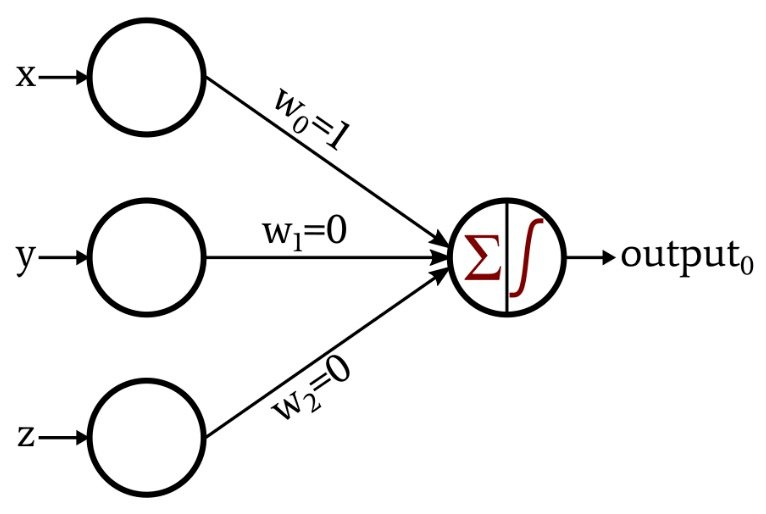

```{r setup, include=FALSE}
knitr::opts_chunk$set(echo = TRUE)
setwd("~/.")
```

# Neural Network Introduction

{width=80%}

## What are they?
A neural network is a parallel, distributed information processing structure consisting of processing elements (nodes) interconnected together with unidirectional signal channels. Each node has a single output connection which branches into as many collateral connections as desired. The node's output signal can be of any mathematical value (can later be converted to non-numerical values). All of the processing that goes on within each node must depend only upon the values of the received input signals arriving at the node via incoming connections and upon values stored in the node's local memory (Hecht-Nielsen 1992).

## Theory behind them
Neural networks are a subset of machine learning that are an amalgamation of modern computer science and cognitive psychology. The data processing and analysis is based on the same process that your brains' neurons undergo to process information. Your neurons require a certain amount of activation energy in order to fire and send information beyond the neuron and along to the axon, to other neurons and so on, an input requirement known as action potential.   

## History of neural networks
- 1943: A couple of old-timey neurophysiologists named McCulloch & Pitts developed the first neural network with electrical circuitry to try to recreate the connections and processing of information withint the brain
- 1949: Donald Webb proposed that neural pathways become stronger with more frequent use
- 1958: Frank Rosenblatt publishes a paper with the **Perceptron** concept as an answer for fly's fight or flight response to stimuli (this was a huge breakthrough)

{width=40%}

- 1959: First application of neural networks from Stanford lab used to filter out noise in phone lines (still used to this day)
- 1969: Start of the AI "dark ages" where the Perceptron idea was killed by MIT followed by the cold war which made people overly-terrified of technology
- 1986: People got over this intellectual blockade and resumed research in AI and more specifically neural networks. This was catalyzed by the re-discovery of an older theory called **Backpropogation** which made neural networks much more applicable for larger, more diverse datasets.
- 2006: The development of the deep neural network (DNN), most common models created to date.

## What led to the development and use of them?
Originally, scientists were simply interested if they could recreate how the human brain works; they really didn't have any desire to make this concept much more than a concept. After WWII and Alan Turing's creation of what would become the modern day computer, scientists that were able to get their hands on this technology could turn it loose on whatever they could imagine including early neural networks. For the next few decades, the theory of artificial intelligence and neural networks developed faster than technology could until modern computer processors and parallel computing caught up with the all of the theory. Now the opposite seems to be true and computing power is allowing for a lot more applications of neural networks and the sky is the limit for real-world applications.

{width=60%}

# Applications and practical uses
{width=60%}

<span style="color: red;">
## Main types of neural networks
</span>
1. Artificial neural network
2. Convolutional neural network
3. Recurrent neural network

## Components of neural network
Neural networks vary A LOT, but most of them have a relatively standard structure.

#### Input layer
#### Hidden layer(s)
#### Output layer
#### Nodes
#### Weights


### Load packages
```{r libraries,message=FALSE}
library(dplyr)
library(neuralnet)
```


### Citations
1. Hecht-Nielsen, R. (1992). Theory of the backpropagation neural network. In Neural networks for perception (pp. 65-93). Academic Press. 
2. 